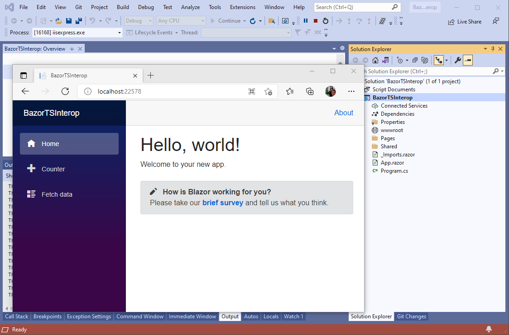
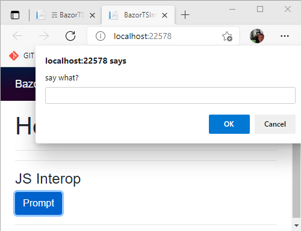
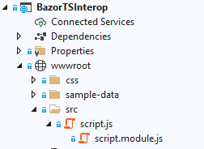
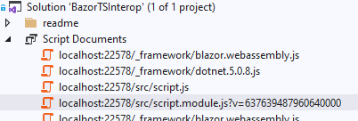
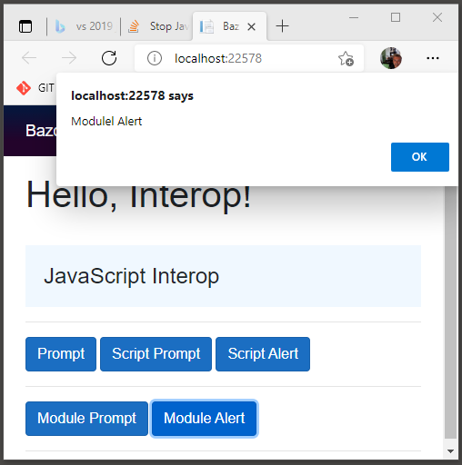
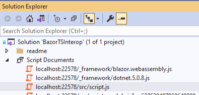

# Blazor Typescript Interop
&nbsp;&nbsp;&nbsp;&nbsp;&nbsp;&nbsp;&nbsp;&nbsp;

&nbsp;&nbsp;&nbsp;&nbsp;This is an article on Blazor Typescript Interop. 
An elegant way to interface your Blazor C# WebAssembly (Wasm) with the browsers JavaScript API and libraries.
Wasm can only communicate with the browser JavaScript API and can't reach outside the browser’s security sandbox.
Calling JavaScript from C# and vice-versa requires some thought. Leveraging TypeScript will guide better interop interface design.
Discussion will contain a brief overview on the technology and variations of how to interop Blazor with Typescript. 
An implementation walkthrough will further explain by code example available on GitHub.
Walkthrough starts off with plain old JavaScript, then progresses to Typescript and Typescript utilizing NPM library.
For more information on Blazor Interop see 
[Microsoft's Blazor JavaScript interoperability](https://docs.microsoft.com/en-us/aspnet/core/blazor/JavaScript-interoperability/?view=aspnetcore-5.0).
  
***     
#### Table of Contents
1. [Create Blazor Project](#1)<br>
2. [Implement JavaScript Interop](#2)<br>
    1. [Call JavaScript Browser API](#2.1)<br>
    2. [Call static JavaScript](#2.2)
    3. [Call isolated JavaScript](#2.3)
3. [Debugging JavaScript](#3)<br>
4. [Implement TypeScript Interop](#4)<br>

***     


&nbsp;&nbsp;&nbsp;&nbsp;**Blazor** is a formative addition to the .NET stack for building .NET Core SPA MVVM websites in 
Wasm coded in C#. Blazor is an attractive alternative to Angular, React, Vue and other JavaScript SPA website architectures for the .NET developer.
Blazor MAUI, a continuation of Xamarin with Blazor webview is another great addition to the .NET stack that completes a .NET developer ecosystem for device and browser applications.


**Typescript** is a superset of JavaScript for application-scale development featuring strong types and geared for object-oriented programming.
Typescript transpiles to JavaScript, so references to JavaScript going forward is either plain old JavaScript or the result of transpiled TypeScript to JavaScript consumable by the browser.
Using Typescript benefits code design such as structural design patterns like facades, adapters and bridges. 


&nbsp;&nbsp;&nbsp;&nbsp;**Interop** is an interface between a higher level coding language to a lower level language, typically the native language of the platform.
Data elements and procedures can be interchanged between the two languages. Blazor out of the box uses interop to communicate with the browser.
The browser executes Wasm code one-way requiring JavaScript interop to communicate back to the browser function. Hence Blazor C# needs JavaScipt interop.
Existing Blazor .NET libraries for the browser, such as the C# WebSocket class, are JavaScript interop wrappers.

---

<ul>
Lets get started.
</ul>  

---

## Part 1 Create Blazor Project<a name="1"></a>
###### To start off we will just create a new blazor app.


> Create new Blazor WebAssembly App.
> 


>  Name it BlazerTSInterop in directory of your choice.
>  


>  Use .NET 5.0 client only, No secutiry and no PWA.
>  


>  CTRL+F5 build and run in hot reload mode.



---

<ul>
<b>Summary</b><br>
A project ready to demontrate JavaScript interop walkthrough has been created.<br>
Ignore Counter and Fetch Data pages that come with the template.
This demo will only use the home page.<br>
</ul>  

---

### Part 2. Implement JavaScript Interop<a name="2"></a>
###### Before we get to Typescript, let's see how JavaScript interops.

<b>1. Call JavaScript Browser API</b><a name="2.1"></a>
<br> 
> Replace all of Index.razor contents with following code snippets respectfully. 
```html
@page "/"
@inject IJSRuntime JS
<h1>Hello, Interop!</h1>
<hr />@Message<hr />
<h4>JS Interop</h4>
<button class="btn btn-primary" @onclick="@Prompt">Prompt</button>
<hr>
```
```c#
@code {
    string Message { get; set; } = "";

    async void Prompt()
    {
        string answer = await JS.InvokeAsync<string>("prompt", "say what?");
        Message = "Prompt: " + (String.IsNullOrEmpty(answer) ? "nothing" : answer);
        StateHasChanged();
    }
}
```
> Save to run in hot reload mode and test.

&nbsp;&nbsp;&nbsp;&nbsp;

---

<b>2. Call static JavaScript</b><a name="2.2"></a>
<br>
> Create new JavaScript file <br>
> Create new 'src' folder for JavaScript and Typescript files.<br>
> Create new 'wwwroot/src/script.js' file.
 
&nbsp;&nbsp;&nbsp;&nbsp;

> Copy code to 'script.js'.
```JavaScript
function ScriptPrompt(message){
    return prompt(message);
}

function ScriptAlert(message) {
    alert(message);
}
```

> ScriptPrompt and ScriptAlert will be statically loaded and global.<br>
> Accessible to other JavaScript modules including isolated modules.<br>
>> Notice the script methods call the browser API prompt and alert respectfully.


> Add 'script.js' as static asset in 'Index.html' after 'webassemly.js'.

```html
<body>
...
    <script src="_framework/blazor.webassembly.js"></script>
    <script src="src/script.js"></script>
...
</body>
```
> Replace all of 'Index.razor' contents with following code snippets respectfully to add ScriptPrompt and ScriptAlert buttons with action method. 

```html
@page "/"
@inject IJSRuntime JS
@implements IAsyncDisposable
<h1>Hello, Interop!</h1><br />
<h4 style="background-color:aliceblue; padding:20px">JavaScript Interop</h4>
@Message<hr />
<button class="btn btn-primary" @onclick="@Prompt">Prompt</button>
<button class="btn btn-primary" @onclick="@ScriptPrompt">Script Prompt</button>
<button class="btn btn-primary" @onclick="@ScriptAlert">Script Alert</button><hr>
```
```c#
@code {
    string Message { get; set; } = "";

    async void Prompt()
    {
        string answer = await JS.InvokeAsync<string>("prompt", "say what?");
        Message = "Prompt: " + (String.IsNullOrEmpty(answer) ? "nothing" : answer);
        StateHasChanged();
    }

    async void ScriptPrompt()
    {
        string answer = await JS.InvokeAsync<string>("ScriptPrompt", "ScriptPrompt say what?");
        Message = "Script Prompt: " + (String.IsNullOrEmpty(answer) ? "nothing" : answer);
        StateHasChanged();
    }

    async void ScriptAlert()
    {
        await JS.InvokeVoidAsync("ScriptAlert", "Script Alert");
    }
}
```
> Prompt demonstrates calling a browser API method.<br>
> ScriptPrompt and  ScriptAlert demonstrate static JavaScript methods.

>Run and test.
 
&nbsp;&nbsp;&nbsp;&nbsp;

<b>3. Call isolated JavaScript</b><a name="2.3"></a>

> Create new 'wwwroot/src/script.module.js' JavaScript file.

&nbsp;&nbsp;&nbsp;&nbsp;

> Copy code to 'script.module.js'.

```JavaScript
export function ModulePrompt(message) {
    return ScriptPrompt(message);
}

export function ModulAlert(message) {
    ScriptAlert(message);
}
```
> Module methods demonstrates calling global script methods.<br>
> > Note the 'export' method prefix.<br>
> > This is ES module syntax to mark code as importable.<br>
> > Not used or recognized by inherently global embedded scripts. 

> Replace all of 'Index.razor' contents with following code snippets respectfully to add Module buttons and methods. 
```html
@page "/"
@inject IJSRuntime JS
@implements IAsyncDisposable
<h1>Hello, Interop!</h1>
<br />
<h4 style="background-color:aliceblue; padding:20px">JavaScript Interop</h4>
@Message
<hr />
<button class="btn btn-primary" @onclick="@Prompt">Prompt</button>
<button class="btn btn-primary" @onclick="@ScriptPrompt">Script Prompt</button>
<button class="btn btn-primary" @onclick="@ScriptAlert">Script Alert</button>
<hr>
<button class="btn btn-primary" @onclick="@ModulelPrompt">Module Prompt</button>
<button class="btn btn-primary" @onclick="@ModulelAlert">Module Alert</button>
<hr>
```
```c#
@code {
    private IJSObjectReference module;
    string Message { get; set; } = "";

    string Version { get { return "?v=" + DateTime.Now.Ticks.ToString(); } }

    async ValueTask IAsyncDisposable.DisposeAsync()
    {
        if (module is not null) { await module.DisposeAsync(); }
    }

    protected override async Task OnAfterRenderAsync(bool firstRender)
    {
        if (firstRender)
        {
            module = await JS.InvokeAsync<IJSObjectReference>("import", "./src/script.module.js" + Version);
        }
    }

    async void ModulelAlert()
    {
        await module.InvokeVoidAsync("ModulAlert", "Modulel Alert");
    }

    async void ModulelPrompt()
    {
        string answer = await module.InvokeAsync<string>("ModulePrompt", "Module Prompt say what?");
        Message = "Module Prompt said: " + (String.IsNullOrEmpty(answer) ? "nothing" : answer);
        StateHasChanged();
    }

    async void Prompt()
    {
        string answer = await JS.InvokeAsync<string>("prompt", "say what?");
        Message = "Prompt said: " + (String.IsNullOrEmpty(answer) ? "nothing" : answer);
        StateHasChanged();
    }

    async void ScriptPrompt()
    {
        string answer = await JS.InvokeAsync<string>("ScriptPrompt", "ScriptPrompt say what?");
        Message = "Script Prompt said: " + (String.IsNullOrEmpty(answer) ? "nothing" : answer);
        StateHasChanged();
    }

    async void ScriptAlert()
    {
        await JS.InvokeVoidAsync("ScriptAlert", "Script Alert");
    }
}
```

>Isolated models support the IAsyncDisposable with the DisposeAsync to cleanup module resources when no longer needed.<br>
>Module is loaded after first render by the OnAfterRenderAsync method.<br>
>ModulePrompt demonstrates calling the static method ScriptPrompt.<br>
>ModuleAlert demonstrates calling another exported method from the same module.<br>

>Notice module appends an unique parameter Version tag when loaded:
>
```c#
...
string Version { get { return "?v=" + DateTime.Now.Ticks.ToString(); } }
...
module = await JS.InvokeAsync<IJSObjectReference>
                    ("import", "./src/script.module.js" + Version);
...
```
>
script.module.js avoids cached by unique param tag. 

<br>
> This is a hack to bypass the browser cache which may stick during development.<br>
> To regain cache performance <b>Version</b> value can be replaced by an application release version number.
> Which will then force a cache refresh once at first client run of new release.   

>Build and run.

&nbsp;&nbsp;&nbsp;&nbsp;


---

<ul>
<b>Summary</b><br>
A project ready to demonstrate JavaScript interop walkthrough has been created.<br>
Ignore Counter and Fetch Data pages that come with the template.
This demo will only use the home page.<br>
</ul>  

---


### Part 3. Debugging JavaScript<a name="3"></a>
###### Now is a good time to review debugging JavaScript from Visual Studio

>Visual Studio may hesitate to attach to the Chrome debugger.<br>
>This issue not exclusive to Blazor.<br>
>More noticeable  as the JavaScript code and symbols grow.<br>
>Here are some situations and workarounds that may help.<br>

Set breakpoint in script.js as shown.<br>
<br>

Run application in debug mode F5.<br>
The debugger is not attached if the breakpoint red circle is hollow.<br>
<br>

You can see the cached file in Script Document folders.<br>
Click on file to see if cached contents are from a prior version.<br>
<br>

Try removing the breakpoint and re-apply.<br>
The debugger may re-attach.<br>
<br>

While app is running, press CTR+Shift+I in browser to view developer tools.<br>
Select src/script.js in Sources panel and set breakpoint at shown.<br>
This will trigger Visual Studio debugger re-attachment to Chrome.<br>
If this does not work, debugging in Chrome will suffice.<br>
<br>

---

<ul>
<b>Summary</b><br> 
Section Part 3 reviews debugging and debugger attachment workarounds.<br>
It is recommended to do a debug code walkthrough to see the interop in action.
</ul>  

---


### Part 4. Implement TypeScript Interop<a name="4"></a>
###### Let's proced to TypeScript interop.
<b>1. Call isolated TypeScript</b><a name="3.1"></a>

> Create new 'wwwroot/src/hello.ts' TypeScript file.

&nbsp;&nbsp;&nbsp;&nbsp;

> Copy code to 'hello.ts'.

```TypeScript
export class Hello {

    hello(): void {
        alert("hello");
    }
    static goodbye(): void {
        alert("goodbye");
    }
}

export var HelloInstance = new Hello()
```